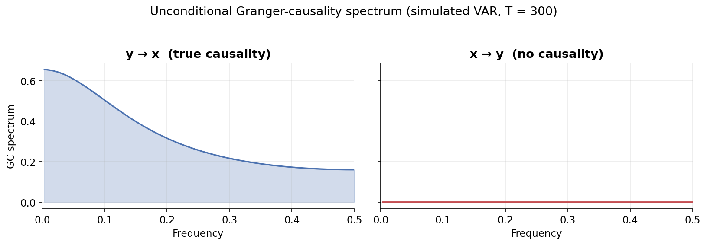
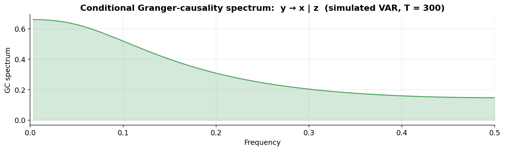
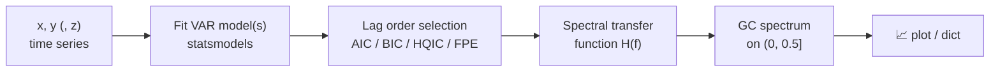

<div align="center">

# 🌊 grangerspy

**Granger-causality spectrum estimation in the frequency domain**

*Which time series drives which — and at which frequency?*

[](https://www.python.org/)
[](LICENSE)
[](https://link.springer.com/chapter/10.1007/978-3-031-53717-2_20)
[](https://www.statsmodels.org/)

</div>

---

Python routines for estimating the **unconditional** (between two time series) and **conditional** (conditioning on a third series) Granger-causality spectrum, paralleling the R package [`grangers`](https://CRAN.R-project.org/package=grangers).

Classical Granger-causality tests give you a single number. The **causality spectrum** tells you *at which frequencies* — i.e., for which cycle periods `1/f` — one series helps predict another. A peak at low frequency means long-run causality; a peak at high frequency means short-cycle causality.

The methodology and a Python-vs-R comparison are described in the companion paper:

> Farnè, M., Yang, M. (2024). *Comparing How Python and R Estimate Granger-Causality in the Frequency Domain.* In: Computing, Internet of Things and Data Analytics (ICCIDA 2023), Studies in Computational Intelligence, vol 1145. Springer, Cham.
> 📄 https://link.springer.com/chapter/10.1007/978-3-031-53717-2_20

## ✨ What it looks like

Simulated VAR process where `y` drives `x` (but not the other way around):



The estimator correctly finds strong causality `y → x` concentrated at low frequencies, and a flat zero spectrum for `x → y`.

Conditioning on a third confounding series `z`:



## ⚙️ How it works



For the **unconditional** spectrum, a bivariate VAR is fitted to `(x, y)` and the causality spectrum is computed in both directions. For the **conditional** spectrum, a bivariate VAR on `(x, z)` and a trivariate VAR on `(x, y, z)` are fitted, and the spectrum `y → x | z` is derived from their transfer functions.

## 📦 Installation

```bash
git clone https://github.com/<your-username>/grangerspy.git
cd grangerspy
pip install .
```

Or just install the dependencies and use the package in place:

```bash
pip install -r requirements.txt
```

Requires Python ≥ 3.8 with `numpy`, `pandas`, `statsmodels`, and `matplotlib`.

## 🚀 Quick start

### Unconditional: `y → x` and `x → y`

```python
import pandas as pd
from grangerspy import granger_unconditional

# x and y can be pandas Series, numpy arrays, or lists (same length)
df = pd.read_csv("your_data.csv")

result = granger_unconditional(df["x"], df["y"], maxlag=5, ic="aic", plot=True)

result["frequency"]         # frequency grid on (0, 0.5]
result["causality_y_to_x"]  # GC spectrum of y on x
result["causality_x_to_y"]  # GC spectrum of x on y
result["lag_order"]         # selected VAR lag order
```

### Conditional: `y → x | z`

```python
from grangerspy import granger_conditional

result = granger_conditional(x, y, z, maxlag=4, ic="bic", plot=True)

result["causality_y_to_x_on_z"]   # conditional GC spectrum
result["lag_order_xz"]            # lag order of the (x, z) VAR
result["lag_order_xyz"]           # lag order of the (x, y, z) VAR
```

### Parameters

| Parameter | Default | Description |
|---|:---:|---|
| `x`, `y`, `z` | — | Input time series (Series, array, or list; equal length) |
| `maxlag` | `1` / `4` | Maximum VAR lag order to consider |
| `ic` | `"aic"` | Order selection: `"aic"`, `"bic"`, `"hqic"`, `"fpe"`, or `None` (use `maxlag` directly) |
| `trend` | `"c"` | Deterministic term: `"c"` constant · `"ct"` + trend · `"ctt"` + quadratic · `"n"` none |
| `plot` | `False` | If `True`, plot the estimated spectrum |

**Reading the output:** values near 0 at a frequency ⇒ no Granger-causality at that frequency; larger values ⇒ stronger causality for the cycle period `1/frequency`.

## 🧪 Examples

Two runnable scripts using the same simulated processes as the figures above:

```bash
python examples/example_unconditional.py
python examples/example_conditional.py
```

## 🗂 Repository structure

```
grangerspy/
├── grangerspy/
│   ├── unconditional.py   # granger_unconditional()
│   ├── conditional.py     # granger_conditional()
│   └── _utils.py
├── examples/              # runnable simulated-data demos
├── assets/                # figures used in this README
├── requirements.txt
├── pyproject.toml
└── LICENSE
```

## 📚 Citation

If you use this code in your research, please cite:

```bibtex
@inproceedings{farne2024granger,
  title     = {Comparing How Python and R Estimate Granger-Causality in the Frequency Domain},
  author    = {Farn{\`e}, Matteo and Yang, Meng},
  booktitle = {Computing, Internet of Things and Data Analytics (ICCIDA 2023)},
  series    = {Studies in Computational Intelligence},
  volume    = {1145},
  pages     = {213--222},
  publisher = {Springer, Cham},
  year      = {2024},
  doi       = {10.1007/978-3-031-53717-2_20}
}
```

## 📄 License

MIT — see [LICENSE](LICENSE).
